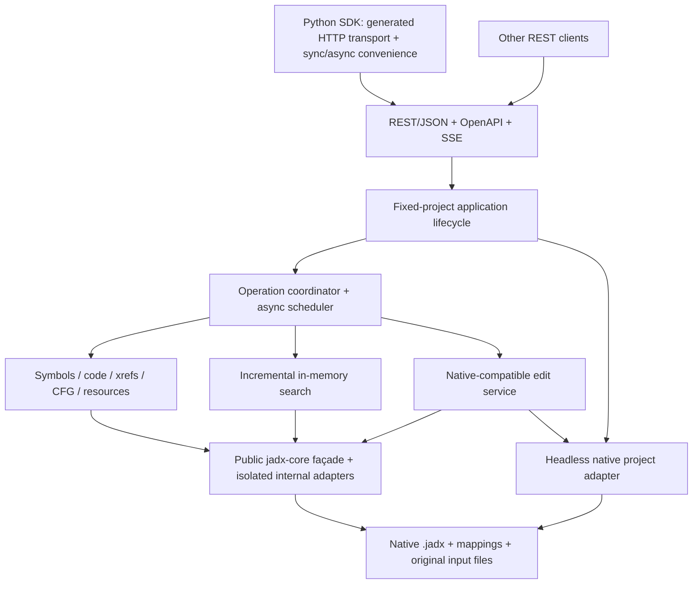

# LibJadx — Architecture and API Design

**Status:** approved architectural baseline; API shapes below are the proposed implementation contract and become binding after review of `openapi/openapi.yaml`.  
**Prepared:** 2026-09-24.  
**Implementation version:** choose and pin the *latest stable Jadx release available when implementation begins*; record the exact tag, Maven artifacts, source commit and compatible JDK in `docs/compatibility.md`. Do not silently substitute Jadx `master`.

[Agent rules](AGENTS.md) · [Detailed implementation instructions](IMPLEMENTATION.md)

## 1. Purpose, boundaries and success criteria

LibJadx is an independently designed headless Java service that makes Jadx analysis accessible to local HTTP clients. It aims for broad functional coverage similar in *purpose* to libghidra, restricted to capabilities actually offered or reliably derivable from Jadx. It is **not** a clone of libghidra's interface, wire protocol, data models or internal architecture.

A successful initial release enables a Python or REST client to start a fixed-project service, observe load progress, list classes and methods, decompile source, follow basic references, perform indexed searches, rename supported entities, save the edits in a Jadx-native project, and open that project with the matching jadx-gui. Success requires contract, concurrency, external-modification and GUI round-trip tests.

### Hard requirements

| Dimension | Approved decision |
|---|---|
| Runtime | Standalone, headless JVM; **exactly one fixed project per process**, specified via CLI at startup. No runtime project switching. Multiple local clients share the project. Independent processes handle additional projects. |
| Jadx dependency | Latest stable release at implementation start, then exact pin. Independent Gradle repository and no permanent Jadx fork. Prefer public APIs; isolate internal APIs. |
| Input | Filesystem-only, at original locations; existing `.jadx` files or any pinned-Jadx-supported input format. **No HTTP upload.** Allowed filesystem roots are configurable. |
| Transport | Versioned REST/JSON, reviewed OpenAPI with automated implementation validation; polling and SSE; structured errors; partial-result/strict modes; hybrid synchronous/asynchronous execution. |
| Networking | Loopback-only (`127.0.0.1`) by default, no initial authentication, no remote bind enabled silently. |
| Persistence | **Only native Jadx project, mapping and supported cache formats**. No separate project DB, job journal, custom persistent search indexes or proprietary additions to `.jadx`. Edits are saved **explicitly**. |
| Close and shutdown | No HTTP project-switch operation. Normal close/disposal discards unsaved edits by default. Shutdown policy: `discard` (default), `save`, `refuse_if_dirty`. Reject incompatible lifecycle changes while work is active. |
| Search | Incremental in-memory symbol/source/resource indexing; partial coverage reported; complete-index async option; only reuse caches already understood by the pinned Jadx release. |
| Analysis | Rich decompilation metadata, instruction-level xrefs where available, original and transformed CFGs independently where available, resources, configurable external classpath. |
| Editing | Supported native renames/comments/mappings, including supported parameters and locals; validated batches, no unproven all-or-nothing guarantee. Unsupported persistent edits are rejected. |
| Versioning | Experimental external API before 1.0. A Python SDK with generated typed transport and handwritten sync/async high-level access ships first. |
| Delivery | Standalone Java archive and launch scripts; no official Docker requirement for the initial release. |

### Explicitly out of scope

GUI plugin/runtime integration; multiple simultaneously loaded projects in one process; runtime project switching; uploads; libghidra protocol or SDK compatibility; custom project persistence; automatic saving/checkpointing; persistent HTTP job history; automatic merge/collaboration with jadx-gui; bytecode editing or APK rebuilding; guaranteed exact CFGs or mappings for all inputs; hard cancellation of arbitrary in-process JVM work; standalone Ghidra functionality not supported by Jadx.

### Reconciliation of superseded decisions

Earlier interview decisions about multi-project session IDs and managed workspaces, automatic checkpoints, SQLite metadata, persisted job records, HTTP uploads, GUI hosting, Docker distribution and autosaves are superseded. There is no `/projects/{id}` API, persistent `jobs` table or service-managed import directory. An export ZIP explicitly requested by the user and an independent server configuration file are permissible operational artifacts; neither is a LibJadx project database.

## 2. High-level architecture



Logical modules and their dependency rules:

- `core`: immutable domain models, revisions, capabilities and service interfaces; **no HTTP or Jadx types in public core contracts**.
- `jadx-adapter`: owns `JadxDecompiler` and pinned-version integration; version-sensitive code stays here. It should never depend on HTTP controllers.
- `project`: native `.jadx` loading/saving, native mappings, external-change detection, allowed-root path policy and portable export.
- `analysis`: symbol queries, decompiled code and metadata, references, inheritance, CFGs and resource analysis.
- `search`: transient incremental indexes, coverage, cursor/snapshot management, and complete-index jobs.
- `scheduler`: per-class/read/global-write coordination, limits, cooperative cancellation, async status, in-memory result retention and SSE events.
- `http`: request validation, JSON DTOs, endpoint implementation, standardized errors, status mapping, SSE and OpenAPI checks.
- `app`: CLI, external server config, project initialization, fixed-project lifecycle and shutdown.
- `python`: generated low-level sync/async transport; handwritten ergonomic API, job progress and typed errors.

Separate **logical boundaries** from physical Gradle modules; a smaller first build may group several modules so long as imports remain directed.

## 3. Lifecycle and ownership

### 3.1 Startup

Exactly one `--project <file.jadx>` or `--input <path>` is required; inputs stay where they are. Additional input files may be specified using a repeated `--input` argument only if the exact CLI contract explicitly supports it and remains **one logical analysis**, not multiple projects. Set the service's identity to a fresh process/session UUID.

1. Parse config (defaults < configuration file < environment < CLI), validate loopback binding and allowed filesystem roots, validate the project/input path.
2. Bind HTTP and expose `/status`/`/health/live` immediately; the runtime moves to `LOADING`.
3. Start an asynchronous initialization job for native project parsing, input verification, `JadxArgs`/`JadxDecompiler` construction and preliminary indexes. The status endpoint exposes stage, done/total when meaningful, errors and cancellation support.
4. Publish the active analysis only after initial loading succeeds; move to `READY`. On failure move to `FAILED`, preserving diagnostics and leaving status endpoints reachable until shutdown.
5. All project endpoints invoked outside READY return structured `PROJECT_NOT_READY` or `SERVICE_SHUTTING_DOWN` errors.

A process is permanently bound to its startup project identity. An explicit **reload** rereads that same project's native files; it cannot switch to a different project path. Settings updates may rebuild the loaded Jadx instance while preserving that identity.

### 3.2 Lifecycle state machine

`STARTING -> LOADING -> READY -> RELOADING -> READY`, with transitions to `FAILED` on unrecoverable initialization failure and `SHUTTING_DOWN -> STOPPED` on termination. No project switching state exists. Stop admitting new work while reloading/shutting down. If incompatible work is running, reject the lifecycle request as `PROJECT_BUSY`; users must await/cancel the work and retry. Cancellation requests are best effort for Jadx operations that do not cooperate.

### 3.3 Shared clients and coordination

All clients of an instance share one active project, unsaved edits, logical revision and in-memory index. Safe reads on different classes may execute concurrently **only after pinned-version stress tests**. Synchronize class loading/decompilation per class; serialize project-wide operations, mutations, saves and any internal APIs without validated thread safety. Enforce configurable maximum active/queued jobs, temporary override instances and cache budgets. No automatic eviction of the one active project.

Lightweight queries are synchronous. Whole-source indexing, bulk decompilation, large searches, export and slow initialization are jobs. Prefer async by default for known expensive operations; support `execution: sync|async|auto` on suitable request bodies. An accepted async operation returns `202 Accepted`, `Location` and a job ID. SSE is optional for consumers; polling is always functional.

Job states: `QUEUED`, `RUNNING`, `CANCELLING`, `SUCCEEDED`, `FAILED`, `CANCELLED`. A successful job may have a `PARTIAL` completeness status. `CANCELLING` may remain until underlying work stops; a request timeout must not report arbitrary JVM work as killed. Job IDs/results/history are volatile and invalid after process restart. Restart lazily or explicitly rebuilds necessary indexes, **not** user job history.

### 3.4 Project-wide settings and temporary overrides

Persistent setting updates are staged against the current in-memory logical project. If accepted while idle, construct a replacement Jadx analysis with the new effective settings and a **deep snapshot of unsaved code data**, verify initialization, then swap and invalidate derived results. On failure retain the previous live analysis and its unsaved edits; return a structured error. A setting is persistable only if the pinned native Jadx project/mapping model can save it. Unpersistable options may be request-only if safe, but must not be represented as saved settings.

Per-request decompiler overrides always use a **single-operation, read-only temporary instance**. Its input is an immutable snapshot of current effective native project settings **and unsaved renames/comments** at admission time; never hand it the live mutable code-data collection. The result includes the snapshot's logical revision and effective-settings fingerprint. Close/release its Jadx instance when the operation finishes, fails or actually stops after cancellation. Do not allow temporary requests to save or mutate the primary project.

## 4. Project storage and native compatibility

### 4.1 Storage rules

- For existing `.jadx`, read that file at its current location and resolve its native referenced inputs/mappings without relocating them. On a raw input, create a new native-compatible project representation when needed for explicit save; do not write it until the user specifies/accepts a native target path or issues an explicit save under a documented native default.
- Preserve all unmodified native project data, including GUI-specific settings/tabs fields and unknown fields supported by the chosen serialization approach. Do not add LibJadx JSON members. Relative path serialization must match the pinned jadx-gui behavior.
- Reuse Jadx-native cache implementations where feasible, and maintain additional search indexes and job data **in memory only**. Logs and external server config may exist outside the project, but must not carry authoritative project edits or revisions.
- Do not confuse `JadxDecompiler.save()` (decompiled source/resources export) with native `.jadx` project serialization. The native project adapter is independently responsible for `.jadx` and mappings.

The currently inspected upstream `jadx-gui` sources provide useful starting points: `JadxProject.loadProjectData`, `ProjectData` and `JadxProject`'s path and code-data adapters. **Do not assume these exact APIs work headlessly in the pinned release**: `JadxProject` references GUI classes, and round-trip validation is a Phase 0 gate.

### 4.2 Save, reload and external changes

`dirty` means in-memory native-saveable edits differ from the last successful native save. `POST /project/save` validates the expected logical revision if supplied and **always** checks the relevant current on-disk native project/mapping state against the baseline observed when opened/last saved. A mismatch returns `EXTERNAL_MODIFICATION_CONFLICT`, never silently overwrites it. This is optimistic detection, **not** a cross-process lock or a guarantee against races with uncooperative GUI processes.

On conflict, `POST /project/pending-edits/export` returns a **transient** machine-readable change set in the HTTP response; no file is created or persisted automatically. The client may save it externally, explicitly discard unsaved changes and reload, then selectively reapply compatible edits. `POST /project/reload` rereads the **same fixed native project**. With unsaved edits, require explicit `discard_unsaved: true`; no silent merge. Config changes on the live project that are accepted cause an internal immediate reload (see 3.4), which is distinct from external-file reload.

A save uses the pinned Jadx release's compatible native serialization behavior; the product intentionally does **not** introduce custom atomic-save or operation-journal machinery. Document that interruption during native file writing may require restoring a user backup. GUI round-trip testing validates saved comments, renames, mappings, settings and input references.

### 4.3 Revisions

```json
{
  "session_id": "random-uuid-per-server-start",
  "logical_revision": 12,
  "persisted_revision": "sha256:...",
  "derived": {
    "symbol_index_revision": 12,
    "source_index_revision": 10,
    "resource_index_revision": 12
  },
  "dirty": true
}
```

This is an illustrative response, not the final wire schema. The persisted fingerprint is derived from relevant **native project, mappings and required input content**, not from a LibJadx sidecar file. Hash large inputs incrementally and report hashing progress/unknown fingerprint until ready. Revalidate project and mapping fingerprints just before save; fingerprint dependencies when they materially affect reproducibility. Logical and derived counters are session-local. Result identifiers and cursors carry `session_id`, relevant logical revision and settings/code-snapshot identity so they cannot be reused across restarts or incompatible decompilation modes.

### 4.4 Export and deletion

Portable export is an **explicit job** that writes a ZIP containing native `.jadx`, referenced input files, native mappings and explicitly configured classpath dependencies when redistributable. Rebase native-relative paths where supported; verify extracted archive can open in the matching jadx-gui and reproduce source behavior. Report omissions, restricted dependencies and unsupported settings. ZIP is an export artifact, not a new project format.

Distinguish `shutdown/close` from filesystem deletion. Since the final design has **no managed workspace**, the older `remove from workspace` concept is inapplicable. A later, separately reviewed destructive command may explicitly delete native project files after the active service has stopped or is quiescent, with a dry-run/preview, allowed-root validation and explicit opt-in for deleting mappings; never delete original inputs as a side effect. This is not part of the initial vertical slice.

## 5. External API contract (proposed)

All routes have prefix `/api/v1`. There are **no HTTP upload routes** and **no dynamic project-open or project-switch routes**. Class/method lookup uses structured descriptor request bodies or query parameters to avoid lossy slash-containing URL segments. Endpoint names below guide the reviewed OpenAPI specification; a naming adjustment must be applied consistently to the server, SDK, tests and these documents.

| Method | Path | Purpose | Initial release? |
|---|---|---|---|
| GET | `/health/live` | Process liveness, available before project load | Yes |
| GET | `/status` | Lifecycle phase, active input identity, loading progress and failures | Yes |
| GET | `/capabilities` | Server, project and result-level capability vocabulary | Yes |
| GET | `/project` | Fixed active project, inputs, native path, dirty and revisions | Yes |
| GET / PATCH | `/project/settings` | Effective settings and supported persistent-setting updates; accepted updates rebuild analysis | Partial |
| POST | `/project/save` | Explicit native save with revision/external-file conflict checks | Yes |
| POST | `/project/reload` | Explicitly reread same project; explicit discard if dirty | Yes |
| POST | `/project/pending-edits/export` | Return unsaved native-compatible edits on conflict | Later |
| POST | `/project/export` | Async native portable ZIP at an allowed output path | Later |
| GET | `/classes` | Filtered/paginated package and class listing | Yes |
| POST | `/symbols/resolve` | Lookup class/method/field by structured original identity | Yes |
| POST | `/decompile` | Java source, Smali and supported lower-level modes with metadata | Java first; Smali next |
| POST | `/references/query` | Callers/callees/field/type references and original locations | Basic first |
| POST | `/analysis/cfg` | Raw or transformed CFG with separate availability | Later |
| POST | `/search` | Symbols/source/regex/strings/annotations/resources; coverage and revisions | Core first |
| POST | `/search/build-index` | Async full coverage indexing | Yes |
| POST | `/edits/batch` | Validate/apply native-saveable rename/comment/mapping edits | Core first |
| POST | `/resources/query` | Manifest/XML/assets and higher-level Android resource analysis | Later |
| GET | `/jobs/{jobId}` | Status, progress, result link/inline result, diagnostics | Yes |
| POST | `/jobs/{jobId}/cancel` | Cooperative cancellation | Yes |
| GET | `/jobs/{jobId}/events` | SSE progress and completion events | Yes |
| POST | `/shutdown` | Explicit configured shutdown policy | Yes |

### 5.1 Symbol and location models

A class identity is `(input_identity, original_descriptor)` **where provenance is preserved by Jadx**. Member identity adds the original member name and JVM/DEX descriptor/signature. Original descriptors are the canonical query key; current aliases and deobfuscated display names are separate attributes. For duplicate definitions that Jadx merged/dropped, return provenance `AMBIGUOUS` or `UNAVAILABLE`; do not fabricate independent members.

Original method parameters favor parameter index, with register/debug identity where available. Local variables use snapshot-scoped identifiers derived from Jadx code metadata and available register/SSA information. Reject variable edits when their source snapshot or logical revision is stale.

Represent locations as distinct coordinate systems: `(source_snapshot_id, source range)` for decompiled code and `(input identity, method descriptor, bytecode offset/range)` for original code; retain original debug source-line info only if available. Define line and column numbering unambiguously in OpenAPI (proposed: 1-based lines and 0-based Unicode-code-point columns), and expose Java/Jadx native UTF-16 offsets or converted UTF-8 byte offsets **with explicit units**. Record precision as `EXACT`, `APPROXIMATE`, `UNKNOWN` or `UNAVAILABLE`; avoid false exactness after inlining or restructuring.

### 5.2 Result envelope and errors

Illustrative normalized response fields:

```json
{
  "status": "COMPLETE",
  "data": {"example": "domain-specific data"},
  "diagnostics": [],
  "provenance": {
    "jadx_version": "<pinned-version>",
    "input_identity": "sha256:...",
    "session_id": "...",
    "logical_revision": 12,
    "effective_settings_hash": "sha256:...",
    "source_snapshot_id": "..."
  },
  "coverage": {"indexed": 420, "eligible": 650, "complete": false}
}
```

A transport error has a stable machine-readable code, message, retryable flag, request ID, optional `details`, nested causes and per-item errors. Example codes: `PROJECT_NOT_READY`, `PROJECT_BUSY`, `INVALID_ENTITY_ID`, `UNSUPPORTED_CAPABILITY`, `INCOMPLETE_ANALYSIS`, `STALE_REVISION`, `EXTERNAL_MODIFICATION_CONFLICT`, `RESOURCE_LIMIT`, `CANCELLATION_PENDING`, `INPUT_SECURITY_REJECTION`, `INTERNAL_ERROR`. Map validation errors to HTTP 400/422, missing entities to 404, revision/busy conflicts to 409, disallowed paths to 403, resource limits to 429/503 and not-ready to 503 with `Retry-After`. **Never include stack traces by default.**

Partial results are successful with `status=PARTIAL`, per-item warnings and explicit coverage. A caller may request `strict=true`; then unmet completeness produces `INCOMPLETE_ANALYSIS` with useful diagnostics (and no claim that output is exact). Use 202 for accepted async work, and distinguish execution job state from the completeness of its eventual result.

### 5.3 Pagination and jobs

Stable, revision-bound lists use `limit`/`offset`; expensive search results use opaque, expiring cursor tokens containing or referencing the session, settings, index revision and query identity. Reject cursors after mutation, reindexing, restart or other incompatible state changes with `STALE_CURSOR`. The Python SDK exposes iterators that surface these conflicts instead of silently skipping/duplicating results.

SSE events include `job.queued`, `job.started`, `job.progress`, `job.completed`, `job.failed`, `job.cancel_requested` and `job.cancelled`, with monotonic per-job event sequence numbers for the **current process lifetime only**. SSE reconnection may replay buffered in-memory events while available; polling is the fallback. Document in-memory result TTLs and bounded buffers. Server restart invalidates all previous job IDs.

## 6. Analysis capabilities

### 6.1 Java/Smali/low-level code

Support class- and method-oriented requests. Since Jadx generally generates Java at class scope, method-level Java excerpts must be extracted with verified declaration/source mapping, not regenerated as if methods were independent. Return class source metadata and method range, and report absence when Jadx inlining obscures a precise method span. Smali is a separately requested representation. Additional IR is optional and must be versioned with its internal adapter.

### 6.2 Cross-references and graph analysis

Offer resolved and unresolved references, original descriptors, source/destination entity identities, reference kind (`CALL`, `READ`, `WRITE`, `TYPE`, etc.) and instruction location when available. Include inheritance, implemented interfaces, related overrides, dependencies, and caller/callee relationships. A reference lacking exact bytecode location is still useful, but marks its precision accordingly.

Expose raw/original and transformed/decompiled CFG independently, with `availability`, representation-specific block/edge IDs, provenance and diagnostics. Verify how the pinned Jadx release exposes its original and transformed graphs. A DOT export alone does not prove a stable in-memory CFG API. Do not infer an "exact original CFG" by parsing decompiled Java. Capability reporting may vary per method.

### 6.3 Resources and classpath

Offer decoded manifest and Android metadata, declared permissions/components, decoded XML, raw assets, strings and resource relationships **where actually resolved**. Raw and decoded resource content remain distinct. Accept explicitly configured external classpath/framework paths through supported Jadx configuration, subject to allowed-root checks; unresolved references remain visible even when dependencies are absent.

## 7. Indexing, editing and invalidation

Initial indexes cover names, original descriptors, annotations, strings and available resource metadata without forcing all source decompilation. Build source-text and reference indexes lazily per class, then allow a complete-index async job. In-memory state stores which eligible classes were indexed under which settings and logical revision; present actual coverage and per-class failures. Never confuse '100% processed' with '100% successfully decompiled'.

Validated editing operations use supported native Jadx renames/comments/mappings. Prefer Jadx-native related-declaration propagation. Validate entity identities, naming rules, revision preconditions, and whether each operation is persistable. A batch that fails prevalidation applies nothing; unexpected mid-execution failure returns the exact per-item applied/failed set. Invalidate affected source, reference and search caches immediately. Index refresh is lazy or an optional background job; a `require_complete`/`require_current` query waits via the job mechanism if needed.

An unsupported persistable operation must fail with `UNSUPPORTED_CAPABILITY`, not silently become an unsaved-only feature. Reports of code-analysis completeness and persistence status are separate.

## 8. Security and operating constraints

Localhost binding does **not** mean any local process is trustworthy. Disable cross-origin access by default, validate `Host`/`Origin` for state-changing requests where possible, require JSON content types on mutating APIs and avoid unsafe GET side effects. This is mitigation, not authentication; users must not expose the port or run the service on untrusted multiuser hosts without adding a separate authenticated boundary.

Canonicalize and check inputs, project references, classpath and export paths against configured allowed roots; revalidate symlinks on destructive writes, avoid traversing outside roots via archive extraction, and never automatically delete original input files. Apply request limits and Jadx's ZIP/XML/input-security defaults; do not disable them to make hostile fixtures pass. Limit source/result sizes, queues, SSE buffers, temporary Jadx instances, cancellation grace and decompilation deadlines. Keep developer stack traces off outside explicit local debug mode.

## 9. Configuration and distribution

Proposed CLI (subject to reviewing the final OpenAPI/CLI documentation):

```bash
libjadx --project /work/sample.jadx --port 18777 --config ~/.config/libjadx/config.yaml
# or one raw input, to be saved later as a native project
libjadx --input /work/sample.apk --port 18778 --allowed-root /work
```

Use a configuration file, environment variables and CLI with precedence **CLI > environment > file > defaults**. Require explicit project/input and use loopback binding by default. A new project created from a raw input can specify its future native `.jadx` save path through the explicit save operation; it must not automatically write a sidecar at startup.

Ship a standalone Java distribution with startup scripts and a Python package. Document the pinned JDK/runtime. Do not require a GUI on production machines. Docker, other SDK languages and remote authenticated hosting may be considered only after explicit approval.

## 10. Python SDK

Build typed transport from the reviewed OpenAPI contract, with synchronized blocking and `asyncio` variants. Add handwritten high-level classes such as `Client`, `Project`, `JavaClass`, `JavaMethod`, `SearchCursor` and `Job`, plus typed exceptions for conflicts, partial analysis and unsupported capabilities. High-level abstractions must preserve underlying revisions and diagnostics, surface expensive operations, and avoid hidden autosaving.

Illustrative *desired usage* (not an implemented API):

```python
from libjadx import Client

with Client("http://127.0.0.1:18777") as client:
    client.wait_ready()
    cls = client.project.class_by_descriptor("Lcom/example/Main;", input_id="...")
    print(cls.decompile().java)
    result = client.project.search("TODO", require_complete=True)
    for hit in result:
        print(hit.location)
    client.project.rename(cls, "MainActivity", expected_revision=client.project.revision)
    client.project.save()  # explicitly persists native Jadx data
```

## 11. Validation and release strategy

The mandatory Phase 0 gate is **headless native project load/save and GUI round-trip** for real rename and comment fixtures. Also prove which xrefs, code offsets, CFG representations and class-level concurrency are attainable. The first experimental release is an end-to-end vertical slice; richer resource queries, variable editing and portable export can follow in subsequent milestones. See [IMPLEMENTATION.md](IMPLEMENTATION.md) for exact work packages, tests, failure handling and exit criteria.

### Known technical risks

1. `JadxProject` lives in `jadx-gui` and uses GUI-dependent types; native serialization may require a thin independent headless codec that reproduces **native** format and retains unknown fields.
2. Jadx's internal graph and code metadata may not expose all requested distinctions with exact provenance. Capability responses and tests prevent fabricated completeness.
3. Jadx may merge or normalize duplicate definitions; original-input provenance is conditional on preservation by the pinned loader.
4. A shared in-process Jadx instance may be unsafe for some parallel operations. Begin conservatively, enable only tested concurrency.
5. Explicit save plus native write behavior means an interrupted save is not guaranteed atomic. No custom persistence layer is permitted.
6. Headless runtime cannot assume `.jadx` stores every GUI-wide decompiler preference. Persist **only** natively representable settings; expose limitations.

## 12. Source and license references

These are **investigation pointers**, not unpinned implementation contracts:

- Jadx repository and license: https://github.com/skylot/jadx
- Jadx public decompiler: https://github.com/skylot/jadx/blob/master/jadx-core/src/main/java/jadx/api/JadxDecompiler.java
- Jadx arguments: https://github.com/skylot/jadx/blob/master/jadx-core/src/main/java/jadx/api/JadxArgs.java
- Native GUI project serialization: https://github.com/skylot/jadx/blob/master/jadx-gui/src/main/java/jadx/gui/settings/JadxProject.java
- Native project data representation: https://github.com/skylot/jadx/blob/master/jadx-gui/src/main/java/jadx/gui/settings/data/ProjectData.java
- Jadx library usage: https://github.com/skylot/jadx/wiki/Use-jadx-as-a-library
- libghidra license reference (do not copy its implementation/contracts): https://github.com/0xeb/libghidra/blob/main/LICENSE

After the version pin, replace implementation citations with links at the exact tag or commit and document tested deviations from these proposed contracts.
