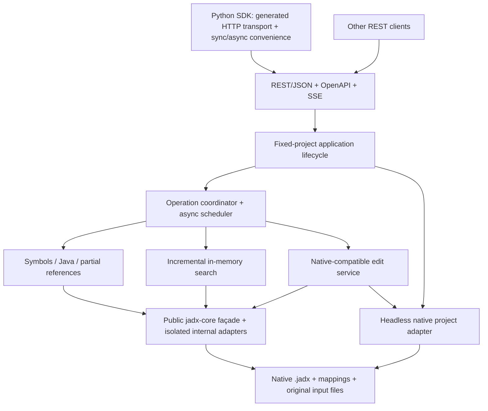

# LibJadx — Architecture and API Design

PR #24 adopts Apache-2.0 before public alpha publication. Fresh qualification
uses `docs/release-evidence/0.1.0-alpha.1/`; PR #22 reports are immutable historical
evidence. Publication remains a separate explicit action.

**Status:** implemented v0.1 architectural baseline, locally release-qualified by PR #22; candidate not published or tagged.
**Original design prepared:** 2026-09-24.
**Current implementation pin:** Jadx 1.5.6 / source `28ff15e4ae69950aebea110a13e5ab895d234dfc`, JDK 21. [OpenAPI](openapi/openapi.yaml) is authoritative for the implemented HTTP contract; illustrative models and Phase 7 goals below are not additional public guarantees.

[Agent rules](AGENTS.md) · [Detailed implementation instructions](IMPLEMENTATION.md)

## 1. Purpose, boundaries and success criteria

LibJadx is a headless Java service for local Jadx analysis, inspired by and modeled in spirit after [libghidra](https://github.com/0xeb/libghidra)'s goal of typed programmatic access to a reverse-engineering engine. LibJadx is independently designed for Jadx and does not copy or implement libghidra's interfaces, protobuf schemas, wire protocol, data models, internal architecture, examples or tests. It is not API/protocol compatible; neither libghidra nor Jadx endorses it.

The qualified v0.1 baseline enables a Python or REST client to start a fixed-project service, observe load progress, list classes and methods, decompile source, follow basic references, perform indexed searches, rename supported entities, save the edits in a Jadx-native project, and open that project with the matching jadx-gui. PR #22 passed the contract, concurrent-client, external-modification and actual matching-GUI gates at its recorded source revision; see [qualification evidence](docs/pr-22-review.md).

### Current v0.1 requirements

| Dimension | Approved decision |
|---|---|
| Runtime | Standalone, headless JVM; **exactly one fixed project per process**, specified via CLI at startup. No runtime project switching. Multiple local clients share the project. Independent processes handle additional projects. |
| Jadx dependency | Pinned Jadx 1.5.6 at `28ff15e4ae69950aebea110a13e5ab895d234dfc`; upgrades require explicit compatibility qualification. Independent Gradle repository and no permanent Jadx fork. Prefer public APIs; isolate internal APIs. |
| Input | Filesystem-only, at original locations; existing `.jadx` files or any pinned-Jadx-supported input format. **No HTTP upload.** Allowed filesystem roots are configurable. |
| Transport | Versioned REST/JSON, reviewed OpenAPI with automated implementation validation; polling and SSE; structured errors; partial-result/strict modes; hybrid synchronous/asynchronous execution. |
| Networking | Loopback-only (`127.0.0.1`) by default, no initial authentication, no remote bind enabled silently. |
| Persistence | **Only native Jadx project, mapping and supported cache formats**. No separate project DB, job journal, custom persistent search indexes or proprietary additions to `.jadx`. Edits are saved **explicitly**. |
| Close and shutdown | No HTTP project-switch operation. Normal close/disposal discards unsaved edits by default. Shutdown policy: `discard` (default), `save`, `refuse_if_dirty`. Reject incompatible lifecycle changes while work is active. |
| Search | Incremental in-memory class/member/emitted-Java indexing; partial coverage reported; complete-index async option; only reuse caches already understood by the pinned Jadx release. |
| Analysis | Java class source, verified method excerpts/token metadata and partial basic references. No public Smali, CFG or resource query API. Deeper analysis/classpath work is Phase 7. |
| Editing | Native declaration renames/LINE comments, strict Tiny v2 import/export, a snapshot-bound parameter subset and PARTIAL related propagation. Local rename is UNSUPPORTED; validated batches expose unexpected partial application rather than unproved rollback. |
| Versioning | Experimental external API before 1.0. Generated typed transport and handwritten sync/async Python access are implemented and locally qualified. |
| Delivery | Standalone Java archive and launch scripts; no official Docker requirement for the initial release. |

### Explicitly out of scope

GUI plugin/runtime integration; multiple simultaneously loaded projects in one process; runtime project switching; uploads; libghidra protocol or SDK compatibility; custom project persistence; automatic saving/checkpointing; persistent HTTP job history; automatic merge/collaboration with jadx-gui; bytecode editing or APK rebuilding; guaranteed exact CFGs or mappings for all inputs; hard cancellation of arbitrary in-process JVM work; standalone Ghidra functionality not supported by Jadx.

### Reconciliation of superseded decisions

Earlier interview decisions about multi-project session IDs and managed workspaces, automatic checkpoints, SQLite metadata, persisted job records, HTTP uploads, GUI hosting, Docker distribution and autosaves are superseded. There is no `/projects/{id}` API, persistent `jobs` table or service-managed import directory. An export ZIP explicitly requested by the user and an independent server configuration file are permissible operational artifacts; neither is a LibJadx project database.

## 2. High-level architecture


```mermaid
flowchart TB
    PC[Python SDK: generated HTTP transport + sync/async convenience]
    RC[Other REST clients]
    PC --> HTTP
    RC --> HTTP
    HTTP[REST/JSON + OpenAPI + SSE]
    HTTP --> APP[Fixed-project application lifecycle]
    APP --> COORD[Operation coordinator + async scheduler]
    COORD --> ANA[Symbols / Java / partial references]
    COORD --> SEARCH[Incremental in-memory search]
    COORD --> EDIT[Native-compatible edit service]
    ANA --> JAD[Public jadx-core façade + isolated internal adapters]
    SEARCH --> JAD
    EDIT --> JAD
    APP --> PROJ[Headless native project adapter]
    EDIT --> PROJ
    PROJ --> NATIVE[Native .jadx + mappings + original input files]
    JAD --> NATIVE
```

Logical modules and their dependency rules:

- `core`: immutable domain models, revisions, capabilities and service interfaces; **no HTTP or Jadx types in public core contracts**.
- `jadx-adapter`: owns `JadxDecompiler` and pinned-version integration; version-sensitive code stays here. It should never depend on HTTP controllers.
- `project`: native `.jadx` loading/saving, native mappings, external-change detection, allowed-root path policy; portable export is Phase 7.
- `analysis`: symbol queries, Java metadata and basic references; deeper inheritance/CFG/resource queries are Phase 7.
- `search`: transient incremental indexes, coverage, cursor/snapshot management, and complete-index jobs.
- `scheduler`: serialized primary-read/global-write coordination, limits, cooperative cancellation, async status, in-memory result retention and SSE events.
- `http`: request validation, JSON DTOs, endpoint implementation, standardized errors, status mapping, SSE and OpenAPI checks.
- `app`: CLI, external server config, project initialization, fixed-project lifecycle and shutdown.
- `python`: generated low-level sync/async transport; handwritten ergonomic API, job progress and typed errors.

These are **logical boundaries**, implemented within the current Gradle application packages; physical modules need not mirror this list. Keep imports directed. Planned analysis/export subsystems must preserve these boundaries.

## 3. Lifecycle and ownership

### 3.1 Startup

Exactly one `--project <file.jadx>` or `--input <path>` is required; inputs stay where they are. Additional input files may be specified using a repeated `--input` argument only if the exact CLI contract explicitly supports it and remains **one logical analysis**, not multiple projects. Set the service's identity to a fresh process/session UUID.

1. Parse config (defaults < configuration file < environment < CLI), validate loopback binding and allowed filesystem roots, validate the project/input path.
2. Bind HTTP and expose `/status`/`/health/live` immediately; the runtime moves to `LOADING`.
3. Start an asynchronous initialization job for native project parsing, input verification, `JadxArgs`/`JadxDecompiler` construction and preliminary indexes. The status endpoint exposes stage, done/total when meaningful, errors and cancellation support.
4. Publish the active analysis only after initial loading succeeds; move to `READY`. On failure move to `FAILED`, preserving diagnostics and leaving status endpoints reachable until shutdown.
5. All project endpoints invoked outside READY return structured `PROJECT_NOT_READY` or `SERVICE_SHUTTING_DOWN` errors.

A process is permanently bound to its startup project identity. An explicit **reload** rereads that same project's native files; it cannot switch to a different project path. Settings updates may rebuild the loaded Jadx instance while preserving that identity.

### 3.2 Lifecycle state machine

`STARTING -> LOADING -> READY -> RELOADING -> READY`, with transitions to `FAILED` on unrecoverable initialization failure and `SHUTTING_DOWN -> STOPPED` on termination. No project switching state exists. Stop admitting new work while reloading/shutting down. If incompatible work is running, reject the lifecycle request as `PROJECT_BUSY`; users must await/cancel the work and retry. Cancellation requests are best effort for Jadx operations that do not cooperate.

### 3.3 Shared clients and coordination

All clients of an instance share one active project, unsaved edits, logical revision and in-memory index. Primary Jadx reads remain serialized; conflicting admission fails `PROJECT_BUSY`. `analysis.concurrent_reads` is UNSUPPORTED (`SERIALIZED_PRIMARY_READS_FAIL_FAST_PROJECT_BUSY`). Serialize project-wide operations, mutations, saves and unverified internal APIs. Enabling future parallel reads requires new pinned-version stress proof. Enforce configurable maximum active/queued jobs, temporary override instances and cache budgets. No automatic eviction of the one active project.

Lightweight queries are synchronous. Complete-source indexing and complete-coverage search use jobs, and initialization is asynchronous. Bulk decompilation and portable export are Phase 7 goals. Prefer async by default for known expensive operations; use the operation-specific sync/job behavior defined in OpenAPI. An accepted async operation returns `202 Accepted`, `Location` and a job ID. SSE is optional for consumers; polling is always functional.

Job states: `QUEUED`, `RUNNING`, `CANCELLING`, `SUCCEEDED`, `FAILED`, `CANCELLED`. A successful job may have a `PARTIAL` completeness status. `CANCELLING` may remain until underlying work stops; a request timeout must not report arbitrary JVM work as killed. Job IDs/results/history are volatile and invalid after process restart. Restart lazily or explicitly rebuilds necessary indexes, **not** user job history.

### 3.4 Project-wide settings and temporary overrides

Persistent setting updates are staged against the current in-memory logical project. If accepted while idle, construct a replacement Jadx analysis with the new effective settings and a **deep snapshot of unsaved code data**, verify initialization, then swap and invalidate derived results. On failure retain the previous live analysis and its unsaved edits; return a structured error. A setting is persistable only if the pinned native Jadx project/mapping model can save it. Unpersistable options may be request-only if safe, but must not be represented as saved settings.

Per-request decompiler overrides always use a **single-operation, read-only temporary instance**. Its input is an immutable snapshot of current effective native project settings **and unsaved renames/comments** at admission time; never hand it the live mutable code-data collection. The result includes the snapshot's logical revision and effective-settings fingerprint. Close/release its Jadx instance when the operation finishes, fails or actually stops after cancellation. Do not allow temporary requests to save or mutate the primary project.

## 4. Project storage and native compatibility

### 4.1 Storage rules

- For existing `.jadx`, read that file at its current location and resolve its native referenced inputs/mappings without relocating them. On a raw input, create a new native-compatible project representation when needed for explicit save; do not write it until the user specifies/accepts a native target path or issues an explicit save under a documented native default.
- Preserve all unmodified native project data, including GUI-specific settings/tabs fields and unknown fields supported by the chosen serialization approach. Do not add LibJadx JSON members. Relative path serialization must match the pinned jadx-gui behavior.
- Reuse Jadx-native cache implementations where feasible, and maintain additional search indexes and job data **in memory only**. Logs and external server config may exist outside the project, but must not carry authoritative project edits or revisions.
- Do not confuse `JadxDecompiler.save()` (decompiled source/resources export) with native `.jadx` project serialization. The native project adapter is independently responsible for `.jadx` and mappings.

The pinned upstream `jadx-gui` sources establish native serialization semantics: `JadxProject.loadProjectData`, `ProjectData` and `JadxProject`'s path and code-data adapters. `JadxProject` references GUI classes. Phase 0 proved the independent headless native codec, and PR #22 qualified matching-GUI persistence; production does not require the GUI.

### 4.2 Save, reload and external changes

`dirty` means in-memory native-saveable edits differ from the last successful native save. `POST /project/save` validates the expected logical revision if supplied and **always** checks the relevant current on-disk native project/mapping state against the baseline observed when opened/last saved. A mismatch returns `EXTERNAL_MODIFICATION_CONFLICT`, never silently overwrites it. This is optimistic detection, **not** a cross-process lock or a guarantee against races with uncooperative GUI processes.

On conflict, `POST /project/pending-edits/export` returns a **transient** machine-readable change set in the HTTP response; no file is created or persisted automatically. The client may save it externally, explicitly discard unsaved changes and reload, then selectively reapply compatible edits. `POST /project/reload` rereads the **same fixed native project**. With unsaved edits, require explicit `discardUnsaved: true`; no silent merge. Config changes on the live project that are accepted cause an internal immediate reload (see 3.4), which is distinct from external-file reload.

A save uses the pinned Jadx release's compatible native serialization behavior; the product intentionally does **not** introduce custom atomic-save or operation-journal machinery. Document that interruption during native file writing may require restoring a user backup. GUI round-trip testing validates saved comments, renames, mappings, settings and input references.

### 4.3 Revisions

```json
{
  "session_id": "random-uuid-per-server-start",
  "logical_revision": 12,
  "persisted_revision": "sha256:...",
  "derived": {
    "symbol_index_revision": 12,
    "source_index_revision": 10,
    "resource_index_revision": 12
  },
  "dirty": true
}
```

This is an illustrative response, not the final wire schema. The persisted fingerprint is derived from relevant **native project, mappings and required input content**, not from a LibJadx sidecar file. Hash large inputs incrementally and report hashing progress/unknown fingerprint until ready. Revalidate project and mapping fingerprints just before save; fingerprint dependencies when they materially affect reproducibility. Logical and derived counters are session-local. Result identifiers and cursors carry `session_id`, relevant logical revision and settings/code-snapshot identity so they cannot be reused across restarts or incompatible decompilation modes.

### 4.4 Portable export and deletion — Phase 7 roadmap

Planned portable export will be an **explicit job** that writes a ZIP containing native `.jadx`, referenced input files, native mappings and explicitly configured classpath dependencies when redistributable. Rebase native-relative paths where supported; verify extracted archive can open in the matching jadx-gui and reproduce source behavior. Report omissions, restricted dependencies and unsupported settings. ZIP is an export artifact, not a new project format.

Distinguish `shutdown/close` from filesystem deletion. Since the final design has **no managed workspace**, the older `remove from workspace` concept is inapplicable. A later, separately reviewed destructive command may explicitly delete native project files after the active service has stopped or is quiescent, with a dry-run/preview, allowed-root validation and explicit opt-in for deleting mappings; never delete original inputs as a side effect. This is not part of the initial vertical slice.

## 5. Implemented external API contract

All routes have prefix `/api/v1`. There are **no HTTP uploads or dynamic project-open/switch routes**. [OpenAPI](openapi/openapi.yaml) defines the exact 22-operation inventory, schemas and examples; the [README route families](README.md#api) provide a compact map.

| Scope | Route families / representations |
| --- | --- |
| Implemented v0.1 | Liveness/status/capabilities/shutdown; native project/settings/save/reload/pending edits; Tiny v2 import/export; classes/symbol resolution; Java decompile/basic references; search/build-index; edit batches; job polling/cancellation/SSE |
| Planned Phase 7 | Portable `/project/export`, `/analysis/cfg`, `/resources/query`, public Smali and richer representations. No current schema or support guarantee is implied. |

Class/member lookup uses structured original descriptors. Contract changes must update server, OpenAPI, generated SDK, fixtures and release matrices in one change. Recognized planned operations return `OPERATION_NOT_IMPLEMENTED` after readiness and are outside the current OpenAPI inventory.

### 5.1 Symbol and location models

A class identity is `(input_identity, original_descriptor)` **where provenance is preserved by Jadx**. Member identity adds the original member name and JVM/DEX descriptor/signature. Original descriptors are the canonical query key; current aliases and deobfuscated display names are separate attributes. For duplicate definitions that Jadx merged/dropped, return provenance `AMBIGUOUS` or `UNAVAILABLE`; do not fabricate independent members.

Original method parameters favor parameter index, with register/debug identity where available.
Local declaration metadata is source-snapshot-scoped and read-only in pinned
1.5.6. PR #20 proves native VAR retargeting under unbound GUI input settings;
no persistent local edit identity or local operation is exposed. Any future
supported variable edit must reject stale source snapshots and logical revisions.

Represent locations as distinct coordinate systems: `(source_snapshot_id, source range)` for decompiled code and `(input identity, method descriptor, bytecode offset/range)` for original code; retain original debug source-line info only if available. Source ranges are zero-based half-open UTF-16 code-unit offsets in the exact returned Java text; line/column fields use the units defined by OpenAPI. They are not Python string indexes or original bytecode offsets. Record precision as `EXACT`, `APPROXIMATE`, `UNKNOWN` or `UNAVAILABLE`; avoid false exactness after inlining or restructuring.

### 5.2 Result envelope and errors

Illustrative normalized response fields:

```json
{
  "status": "COMPLETE",
  "data": {"example": "domain-specific data"},
  "diagnostics": [],
  "provenance": {
    "jadx_version": "<pinned-version>",
    "input_identity": "sha256:...",
    "session_id": "...",
    "logical_revision": 12,
    "effective_settings_hash": "sha256:...",
    "source_snapshot_id": "..."
  },
  "coverage": {"indexed": 420, "eligible": 650, "complete": false}
}
```

A transport error has a stable machine-readable code, message, retryable flag, request ID, optional `details`, nested causes and per-item errors. Example codes: `PROJECT_NOT_READY`, `PROJECT_BUSY`, `INVALID_ENTITY_ID`, `UNSUPPORTED_CAPABILITY`, `INCOMPLETE_ANALYSIS`, `STALE_REVISION`, `EXTERNAL_MODIFICATION_CONFLICT`, `RESOURCE_LIMIT`, `CANCELLATION_PENDING`, `INPUT_SECURITY_REJECTION`, `INTERNAL_ERROR`. Map validation errors to HTTP 400/422, missing entities to 404, revision/busy conflicts to 409, disallowed paths to 403, resource limits to 429/503 and not-ready to 503 with `Retry-After`. **Never include stack traces by default.**

Partial results are successful with `status=PARTIAL`, per-item warnings and explicit coverage. A caller may request `strict=true`; then unmet completeness produces `INCOMPLETE_ANALYSIS` with useful diagnostics (and no claim that output is exact). Use 202 for accepted async work, and distinguish execution job state from the completeness of its eventual result.

### 5.3 Pagination and jobs

Stable, revision-bound lists use `limit`/`offset`; expensive search results use opaque, expiring cursor tokens containing or referencing the session, settings, index revision and query identity. Reject cursors after mutation, reindexing, restart or other incompatible state changes with `STALE_REVISION`. The Python SDK exposes iterators that surface these conflicts instead of silently skipping/duplicating results.

SSE events include `job.queued`, `job.started`, `job.progress`, `job.completed`, `job.failed`, `job.cancel_requested` and `job.cancelled`, with monotonic per-job event sequence numbers for the **current process lifetime only**. SSE reconnection may replay buffered in-memory events while available; polling is the fallback. Document in-memory result TTLs and bounded buffers. Server restart invalidates all previous job IDs.

## 6. Analysis capabilities

### 6.1 Current Java source and Phase 7 representations

Support class- and method-oriented requests. Since Jadx generally generates Java at class scope, method-level Java excerpts must be extracted with verified declaration/source mapping, not regenerated as if methods were independent. Return class source metadata and method range, and report absence when Jadx inlining obscures a precise method span. The public Smali representation is UNSUPPORTED in v0.1 despite successful internal retrieval probes. A separately requested Smali representation and additional versioned IR are Phase 7 goals requiring their own reviewed contracts.

### 6.2 Cross-references and graph analysis

v0.1 reports Jadx-observed method pairs, field users, class dependencies and unresolved original method descriptors with PARTIAL coverage. Optional source sites are verified against a Java snapshot. READ/WRITE distinctions and original instruction offsets are unavailable. Deeper reference kinds, inheritance queries and exact instruction provenance are Phase 7 goals.

For Phase 7, expose raw/original and transformed/decompiled CFG independently, with `availability`, representation-specific block/edge IDs, provenance and diagnostics. Verify how the pinned Jadx release exposes its original and transformed graphs. A DOT export alone does not prove a stable in-memory CFG API. Do not infer an "exact original CFG" by parsing decompiled Java. Capability reporting may vary per method.

### 6.3 Resources and classpath — Phase 7 roadmap

Future resource APIs should offer decoded manifest and Android metadata, declared permissions/components, decoded XML, raw assets, strings and resource relationships **where actually resolved**. Raw and decoded resource content remain distinct. Accept explicitly configured external classpath/framework paths through supported Jadx configuration, subject to allowed-root checks; unresolved references remain visible even when dependencies are absent.

## 7. Indexing, editing and invalidation

Current indexes cover class names immediately, with member names and emitted-Java source ingested as owners are processed. Complete-index jobs scan eligible Jadx-visible owners. Original string constants, annotation/resource search and exhaustive input coverage are unverified; they are Phase 7 investigations. In-memory state stores which eligible classes were indexed under which settings and logical revision; present actual coverage and per-class failures. Never confuse '100% processed' with '100% successfully decompiled'.

Validated editing operations use supported native Jadx renames/comments/mappings. Explicit related-method propagation uses the independent COMPLETE verifier and standard per-member native records under the PR #19 admission rules below. Validate entity identities, naming rules, revision preconditions, and whether each operation is persistable. A batch that fails prevalidation applies nothing; unexpected mid-execution failure returns the exact per-item applied/failed set. Invalidate affected source, reference and search caches immediately. Index refresh is lazy or an optional background job; `requireComplete` search returns a job when additional indexing is needed, while `strict` rejects partial coverage.

An unsupported persistable operation must fail with `UNSUPPORTED_CAPABILITY`, not silently become an unsaved-only feature. Reports of code-analysis completeness and persistence status are separate.

## 8. Security and operating constraints

Localhost binding does **not** mean any local process is trustworthy. Disable cross-origin access by default, validate `Host`/`Origin` for state-changing requests where possible, require JSON content types on mutating APIs and avoid unsafe GET side effects. This is mitigation, not authentication; users must not expose the port or run the service on untrusted multiuser hosts without adding a separate authenticated boundary.

Canonicalize and check inputs, project references, classpath and export paths against configured allowed roots; revalidate symlinks on destructive writes, avoid traversing outside roots via archive extraction, and never automatically delete original input files. Apply request limits and Jadx's ZIP/XML/input-security defaults; do not disable them to make hostile fixtures pass. Limit source/result sizes, queues, SSE buffers, temporary Jadx instances, cancellation grace and decompilation deadlines. Keep developer stack traces off outside explicit local debug mode.

## 9. Configuration and distribution

Current CLI (see [configuration](docs/configuration.md) for complete options):

```bash
libjadx --project /work/sample.jadx --port 18777 --config ~/.config/libjadx/config.yaml
# or one raw input, to be saved later as a native project
libjadx --input /work/sample.apk --port 18778 --allowed-root /work
```

Use a configuration file, environment variables and CLI with precedence **CLI > environment > file > defaults**. Require explicit project/input and use loopback binding by default. A new project created from a raw input can specify its future native `.jadx` save path through the explicit save operation; it must not automatically write a sidecar at startup.

Ship a standalone Java distribution with startup scripts and a Python package. Document the pinned JDK/runtime. Do not require a GUI on production machines. Docker, other SDK languages and remote authenticated hosting may be considered only after explicit approval.

## 10. Python SDK

The SDK generates typed transport from the reviewed OpenAPI contract, with synchronized blocking and `asyncio` variants. It provides handwritten high-level classes such as `Client`, `Project`, `JavaClass`, `JavaMethod`, `SearchCursor` and `Job`, plus typed exceptions for conflicts, partial analysis and unsupported capabilities. High-level abstractions must preserve underlying revisions and diagnostics, surface expensive operations, and avoid hidden autosaving.

Implemented usage and conflict handling are documented in [python/README.md](python/README.md) and [SDK architecture](docs/phase-6-python-sdk.md). The SDK connects to an already running fixed-project service; it does not start Java, autosave or retry stale mutations implicitly.

## 11. Validation and release strategy

The initial release was gated by **headless native project load/save and actual matching-GUI round trips**. Phases 0–6 are complete for the defined v0.1 scope; [PR #22](docs/pr-22-review.md) records 22/22 operations, 19/19 errors, five client surfaces, installed wheels on Python 3.11/3.14, reproducible archives and all twelve matching-GUI gates at the qualified source revision. The candidate remains untagged/unpublished.

The [release runbook](docs/phase-6-release-qualification.md) defines repeatable qualification and strict evidence freshness. Existing evidence is not a qualification of every later Git revision. Phase 7 requires fresh capability probes and relevant regression/GUI gates before advertising deeper analysis or persistence. See [IMPLEMENTATION.md](IMPLEMENTATION.md) for retained historical acceptance criteria and the active roadmap.

### Known technical risks

1. `JadxProject` lives in `jadx-gui` and uses GUI-dependent types; the independent headless codec reproduces **native** format and retains unknown fields where promised; serialization changes require renewed GUI qualification.
2. Jadx's internal graph and code metadata may not expose all requested distinctions with exact provenance. Capability responses and tests prevent fabricated completeness.
3. Jadx may merge or normalize duplicate definitions; original-input provenance is conditional on preservation by the pinned loader.
4. A shared in-process Jadx instance may be unsafe for some parallel operations. Primary reads remain serialized/fail-fast; enable parallelism only after new proof.
5. Explicit save plus native write behavior means an interrupted save is not guaranteed atomic. No custom persistence layer is permitted.
6. Headless runtime cannot assume `.jadx` stores every GUI-wide decompiler preference. Persist **only** natively representable settings; expose limitations.

## 12. Source and license references

LibJadx first-party source and documentation use [Apache-2.0](LICENSE). Jadx is separate upstream work under Apache-2.0. libghidra is product inspiration only; its Human-Origin license applies to libghidra itself, not independently created LibJadx work.

Jadx implementation references are pinned to the supported source commit:

- Jadx repository and license: https://github.com/skylot/jadx
- Jadx public decompiler: https://github.com/skylot/jadx/blob/28ff15e4ae69950aebea110a13e5ab895d234dfc/jadx-core/src/main/java/jadx/api/JadxDecompiler.java
- Jadx arguments: https://github.com/skylot/jadx/blob/28ff15e4ae69950aebea110a13e5ab895d234dfc/jadx-core/src/main/java/jadx/api/JadxArgs.java
- Native GUI project serialization: https://github.com/skylot/jadx/blob/28ff15e4ae69950aebea110a13e5ab895d234dfc/jadx-gui/src/main/java/jadx/gui/settings/JadxProject.java
- Native project data representation: https://github.com/skylot/jadx/blob/28ff15e4ae69950aebea110a13e5ab895d234dfc/jadx-gui/src/main/java/jadx/gui/settings/data/ProjectData.java
- Jadx library usage: https://github.com/skylot/jadx/wiki/Use-jadx-as-a-library
- libghidra project — product inspiration: https://github.com/0xeb/libghidra
- libghidra license — human review before reuse; no copying of implementation/contracts: https://github.com/0xeb/libghidra/blob/main/LICENSE

Tested capability boundaries are recorded in [compatibility](docs/compatibility.md) and the [feasibility matrix](docs/feasibility-matrix.md).

## 13. Current alias semantics and replacement publication

This section supersedes PR #17's requirement to preserve every incidental alias.
Automatic Jadx aliases are derived analysis state: collision aliases,
deobfuscation aliases without explicit persistence, and other generated aliases
may be recomputed when an edit changes analysis. A declaration with no explicit
rename may therefore change its display alias without a separate user edit.
Native declaration renames, mapping aliases/comments, supported scoped renames,
retained VAR records and declaration comments remain authoritative. Original
identities, settings, ordered input references and unknown native fields retain
their existing preservation rules. Never add native records to freeze generated
aliases.

Effective native batches now privately stage complete code data, load one fresh
production engine, commit native data once, then publish that engine under the
existing exclusive lease. No-op retains the engine and revisions; candidate
failure publishes nothing. See [replacement publication](docs/phase-5-replacement-publication.md) for ordering,
failures, oracle, persistence and validation. PR #19's
[verified group admission](docs/phase-5-related-group-admission.md) now supplies same-lease
COMPLETE verification, immutable plans, all-owner raw collision checks and exact
native records/affectedRefs. Local editing remains unsupported.

## 14. Current related-method group admission

This section supersedes prior propagation deferrals. Explicit METHOD RENAME
`propagateRelated: true` admits only independently COMPLETE closed-input families
verified synchronously against the captured current engine under one exclusive
edit lease. Immutable sorted original/native plans, raw all-owner collision
inventory, full-batch overlap checks and group-private atomic staging precede
PR #18 fresh replacement publication. Ordinary omitted/false retains one-record
semantics and empty affectedRefs. Applied and verified no-op groups return exact
original family refs; no-op requires every explicit member record already present.

Limits: 64 per family; four propagated items, 128 total members and 800000 reserved
verification work per batch. No class or ordinary method rename shares a group
batch; parameter edits on members reject. Field renames and declaration comments
may coexist. Raw hidden bridge/synthetic methods block collisions,
without becoming admitted members. Standard Jadx records persist only on explicit
save. Restart/discard/reload, accepted input/mapping conflicts and actual matching
GUI Save As retain their native-only behavior. Covariant/bridge, missing/external,
duplicate, local and parameter propagation remain unsupported. PR #20 closes
Phase 5.2 with the local exclusion below. Phase 6 SDK and qualification are complete; external publication remains separate.

See [admission, status mapping, ordering and persistence](docs/phase-5-related-group-admission.md)
and [final-head validation](docs/pr-19-review.md).

## 15. Current native local identity boundary

Outcome B: local-variable mutation remains unsupported. Native VAR records bind
only an original method and packed register/SSA; a current source snapshot
cannot bind their future meaning to GUI-wide mode and input-loader settings.
An owned one-local straight-line method retargets an exact nonmerged VAR key
from an absolute value to its square under normal Use dx/d8 configuration.
Same-mode replay, save/reopen and record preservation are insufficient.
No custom identity or persistence layer is permitted by this architecture.
Phase 5.2 is complete for safely proved native edit forms. Phase 6 subsequently completed; Phase 7 is the active roadmap.
See [feasibility and exclusions](docs/phase-5-local-rename-feasibility.md) and
[validation](docs/pr-20-review.md).
